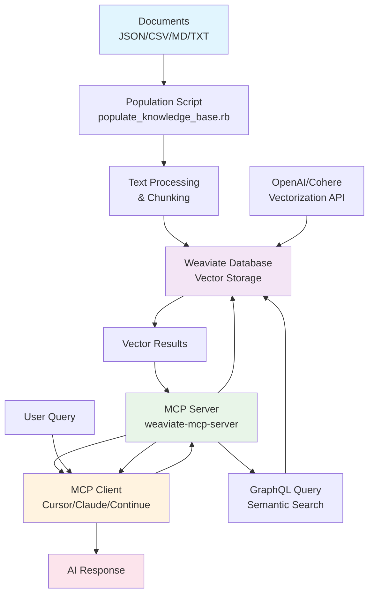

# Weaviate MCP Server


A Model Context Protocol (MCP) server for seamless integration with Weaviate, enabling semantic search in knowledge bases through conversational AI.

## 🏗️ Architecture



## 🚀 Features

- **MCP Server** for vector queries in Weaviate
- **Knowledge Base Population** with multiple file formats
- **Semantic Search** using GraphQL
- **Intelligent Chunking** for large documents
- **Automatic Schema** creation
- **Real-time Queries** with filtering

## ⚡ Quick Start

### Prerequisites
- Ruby 3.4.3+
- Docker and Docker Compose
- OpenAI API key (recommended)

### Setup
```bash
# Clone and install
git clone https://github.com/your-username/weaviate_mcp_server.git
cd weaviate_mcp_server
bundle install

# Start Weaviate
docker compose up -d

# Populate knowledge base
./bin/populate_knowledge_base.rb examples/sample_documents.json

# Test MCP server
ruby examples/example_usage.rb
```

## 📊 MCP Server

### MCP Client Integration
Configure with MCP clients like Cursor, Continue, or Claude Desktop:

```json
{
  "servers": {
    "weaviate": {
      "command": "ruby",
      "args": ["/path/to/weaviate_mcp_server/bin/weaviate-mcp-server"]
    }
  }
}
```

### Available Tools
- **weaviate_query**: Semantic search with GraphQL
  - Property selection control
  - Result limiting and filtering
  - Vector similarity search

## 📚 Knowledge Base Population

### Supported Formats
- **JSON**: Arrays or single objects with `title` and `content`
- **CSV**: Headers required, uses 'content' and 'title' columns
- **Text/Markdown**: Automatic processing or chunking

### Basic Usage
```bash
# Add documents
./bin/populate_knowledge_base.rb documents.json

# Split large files into chunks
./bin/populate_knowledge_base.rb -s 1000 large_document.md

# Custom class name
./bin/populate_knowledge_base.rb -c "Articles" content.json

# List existing classes
./bin/populate_knowledge_base.rb -l
```

### Schema
Automatic schema creation with:
- `title`, `content`, `source_file`
- `category`, `author`, `created_at`
- `chunk_index` (for split texts)

## 🔧 Configuration

### Weaviate Setup
```yaml
# compose.yml
services:
  weaviate:
    image: cr.weaviate.io/semitechnologies/weaviate:1.24.6
    ports:
      - "8080:8080"
    environment:
      AUTHENTICATION_ANONYMOUS_ACCESS_ENABLED: 'true'
      DEFAULT_VECTORIZER_MODULE: 'text2vec-openai'
      ENABLE_MODULES: 'text2vec-openai,text2vec-cohere,text2vec-huggingface'
      OPENAI_API_KEY: ${OPENAI_API_KEY}
```

### Vectorization
Set environment variables for your chosen provider:
- `OPENAI_API_KEY` (default)
- `COHERE_API_KEY`
- `HUGGINGFACE_API_KEY`

## 🎯 Use Cases

- **Documentation Search**: Technical docs with semantic understanding
- **Customer Support**: FAQ and knowledge base queries
- **Research**: Academic papers and content discovery
- **RAG Applications**: Retrieval Augmented Generation workflows

## 🔍 Query Examples

### MCP Client Query
```ruby
{
  jsonrpc: '2.0',
  method: 'tools/call',
  params: {
    name: 'weaviate_query',
    arguments: {
      class_name: 'Document',
      query: 'machine learning concepts',
      limit: 5,
      properties: ['title', 'content']
    }
  }
}
```

### With Filters
```ruby
{
  where_filter: {
    path: ['category'],
    operator: 'Equal',
    valueText: 'AI'
  }
}
```

## 🚀 RAG Integration

Perfect for RAG applications:

```ruby
# 1. Query relevant documents
documents = weaviate_query(query: user_question, limit: 3)

# 2. Create context for LLM
context = documents.map { |doc| doc['content'] }.join("\n\n")
prompt = "Context: #{context}\n\nQuestion: #{user_question}"
```

## 🐛 Troubleshooting

### Common Issues
- **Connection Error**: Check `docker ps` and `curl http://localhost:8080/v1/.well-known/ready`
- **Vectorization Error**: Verify API keys and module configuration
- **Encoding Issues**: Ensure UTF-8 encoding, use `-v` flag for logs

### Verification
```bash
# Check documents
./bin/populate_knowledge_base.rb --count Document

# Monitor Weaviate
docker compose logs weaviate
```

## 🤝 Contributing

1. Fork the repository
2. Create a feature branch
3. Add tests for new functionality
4. Submit a pull request

### Development
```bash
bundle install
bundle exec rspec      # Run tests
bundle exec rubocop    # Check code style
```

## 📄 License

MIT License - see [LICENSE](LICENSE) file for details.

## 📞 Support

- [Issues](../../issues) for bug reports
- [Discussions](../../discussions) for questions
- [Examples](examples/) for usage patterns

---

**Built with ❤️ for the AI community** 